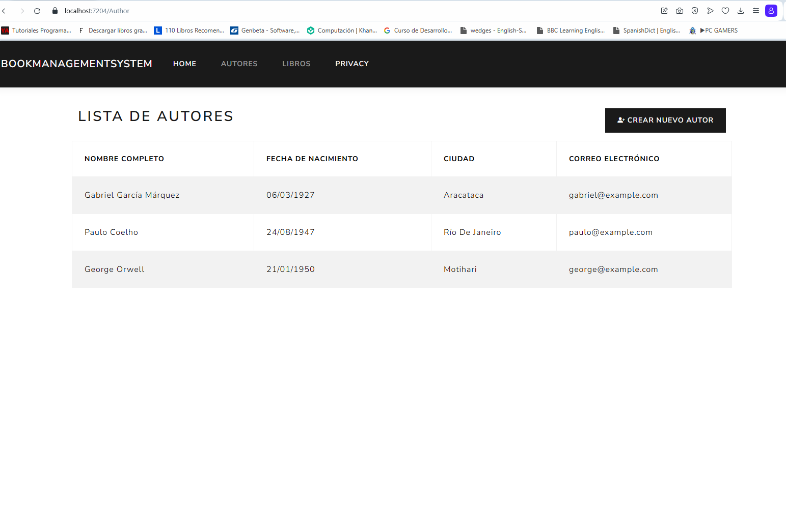
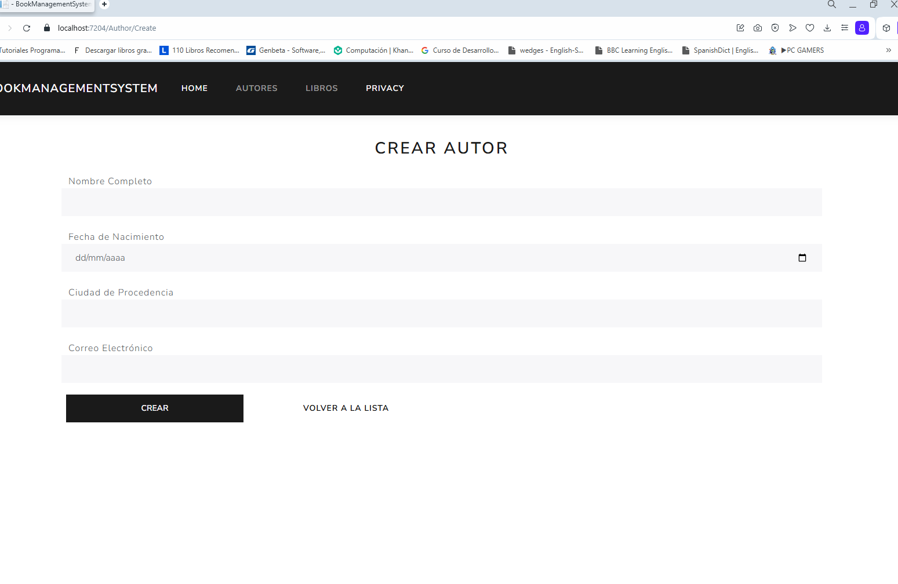
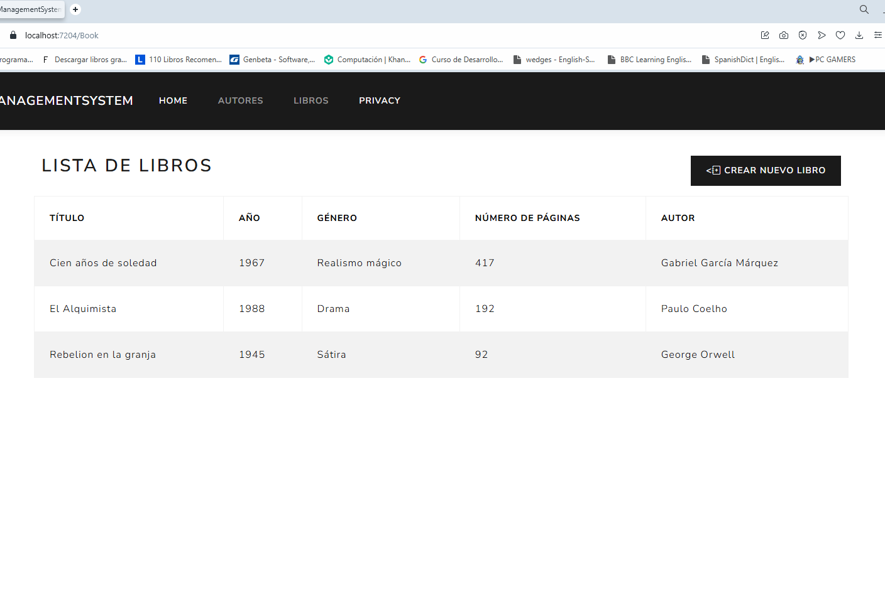
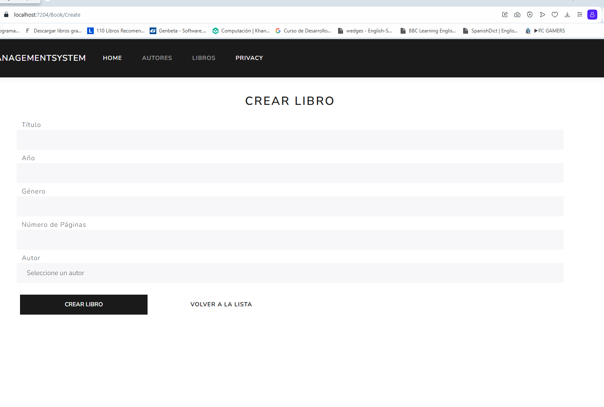
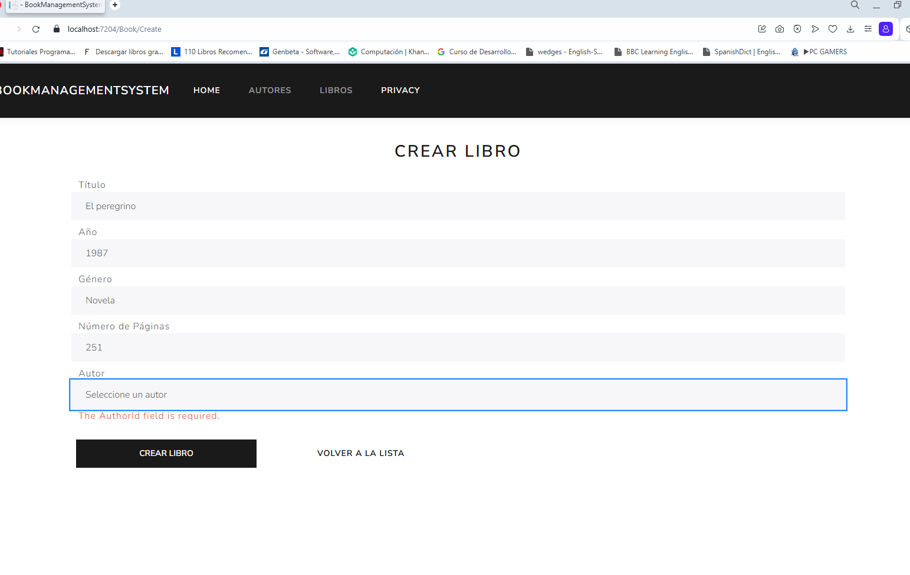
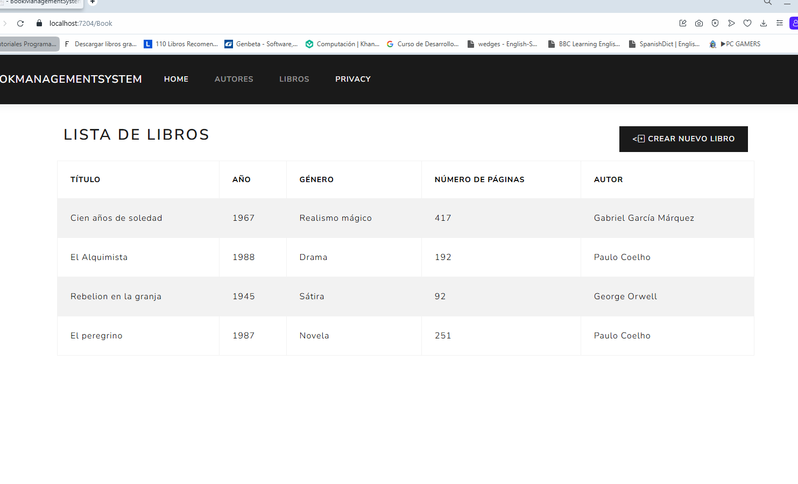

# Book Management System

Aplicación web desarrollada en **.NET 8 Core MVC** para gestionar libros y autores. Permite registrar y listar información de libros y autores, con validaciones y reglas de negocio específicas.

## Características

- **Registro de Autores**: Nombre completo, fecha de nacimiento, ciudad de procedencia y correo electrónico.
- **Registro de Libros**: Título, año, género, número de páginas y autor asociado.
- **Reglas de Negocio**:
  - Todos los campos marcados como obligatorios deben completarse.
  - Máximo de 20 libros permitidos; si se supera, se lanza una excepción.
  - No se puede registrar un libro si el autor no existe.
- **Tecnologías**:
  - Backend: .NET 8, Entity Framework Core con SQL Server.
  - Frontend: Razor Views con Bootstrap.
  - Arquitectura: Uso de DTOs, servicios, interfaces y excepciones personalizadas.

## Requisitos

- [.NET 8 SDK](https://dotnet.microsoft.com/en-us/download/dotnet/8.0)
- [SQL Server](https://www.microsoft.com/en-us/sql-server/sql-server-downloads) (o LocalDB para desarrollo)
- [Visual Studio 2022](https://visualstudio.microsoft.com/) (opcional, pero recomendado) o cualquier editor como VS Code.
- Herramientas de línea de comandos de EF Core (`dotnet-ef`).

## Instalación

 **Clonar el repositorio**:
   ```bash
   git clone https://github.com/AlexisMartinez1913/book-management-system.git
   cd book-management-system

   dotnet restore
   ```

   ## Configurar la base de datos
   - Edita appsettings.json para ajustar la cadena de conexión si usas un servidor SQL diferente:
```bash
"ConnectionStrings": {
  "DefaultConnection": "Server=.;Database=DBBOOKS;Trusted_Connection=True;TrustServerCertificate=True"
  }
```
## Instala las herramientas EF CORE:
```bash
dotnet tool install --global dotnet-ef
```
## Aplica las migraciones
```bash
dotnet ef migrations add InitialCreate
dotnet ef database update
```
## Ejecuta la aplicacion
```bash
dotnet run
```

## Estructura Del Proyecto
```bash
BookManagementSystem/
├── Controllers/           # Controladores MVC (AuthorController, BookController)
├── Data/                  # Contexto de base de datos (ApplicationDbContext)
├── Dtos/                  # Objetos de transferencia de datos (AuthorDTO, BookDTO)
├── Entities/              # Modelos de la base de datos (Author, Book)
├── Exceptions/            # Excepciones personalizadas (MaxBooksExceededException, AuthorNotFoundException)
├── Interfaces/            # Contratos para servicios (IAuthorService, IBookService)
├── Services/              # Implementación de la lógica de negocio (AuthorService, BookService)
├── Views/                 # Vistas Razor (Author/, Book/, Shared/)
├── appsettings.json       # Configuración (cadena de conexión)
├── Program.cs             # Configuración de la aplicación y DI
└── README.md              # Este archivo
```
## Notas
Usa el menú en la barra de navegación para acceder a las secciones de "Autores" y "Libros".

Las validaciones en los formularios aseguran que todos los campos obligatorios estén completos.

### Imagenes App Corriendo
## Autores

## Crear Autor

## Libros

## Crear Libros

## Validación

## Agregando Libro



